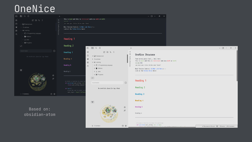
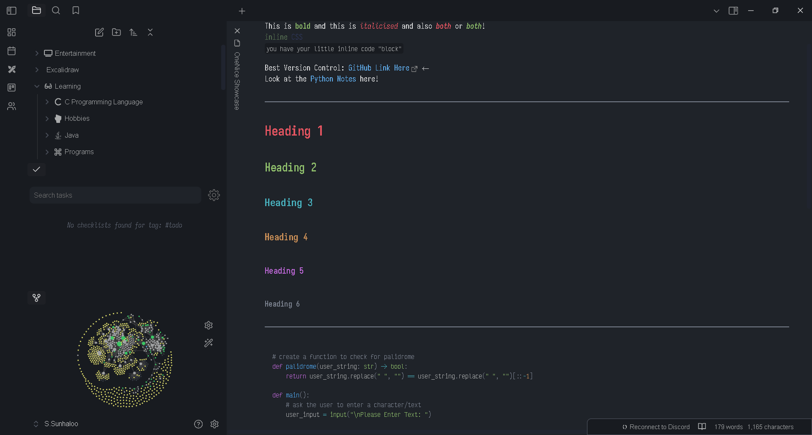
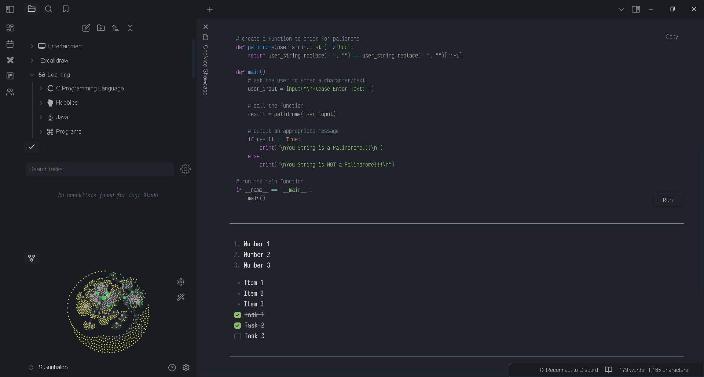
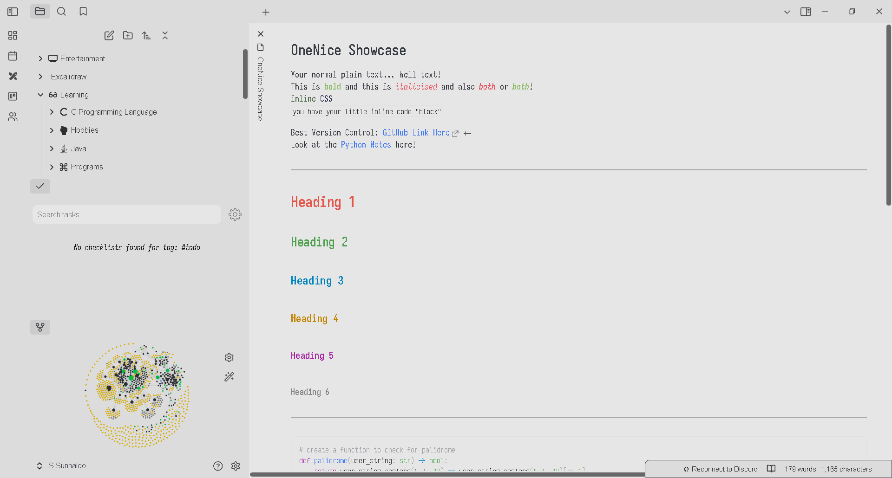
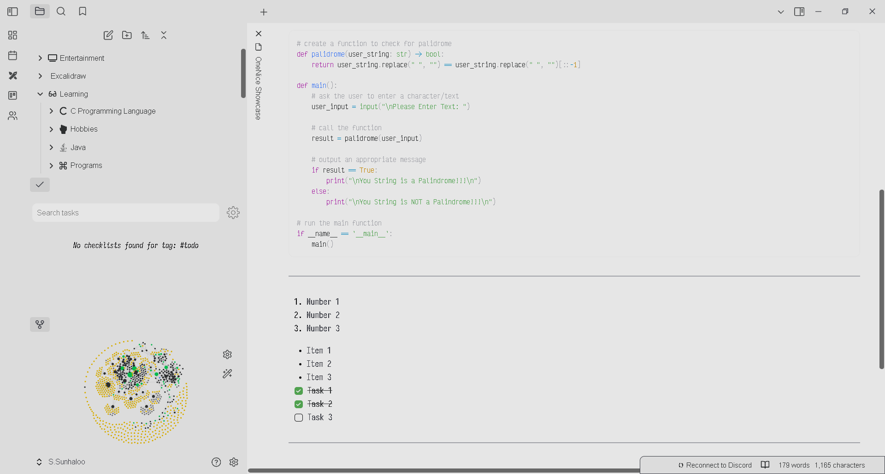
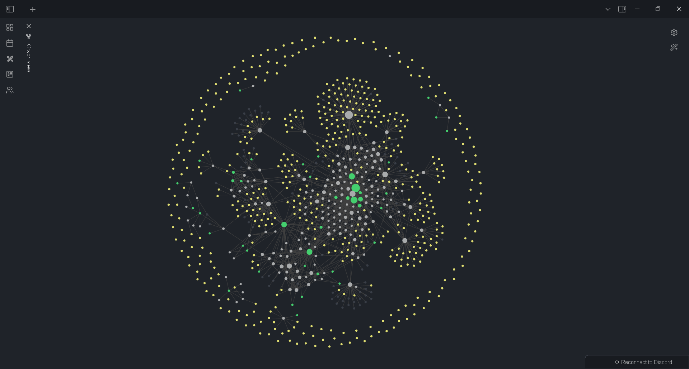
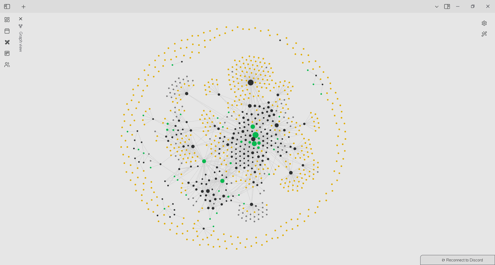
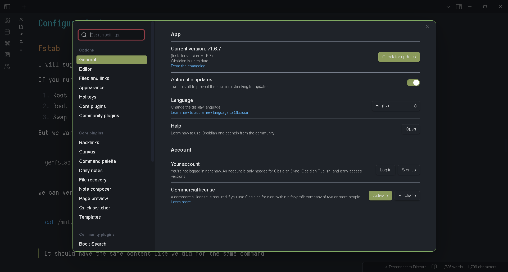
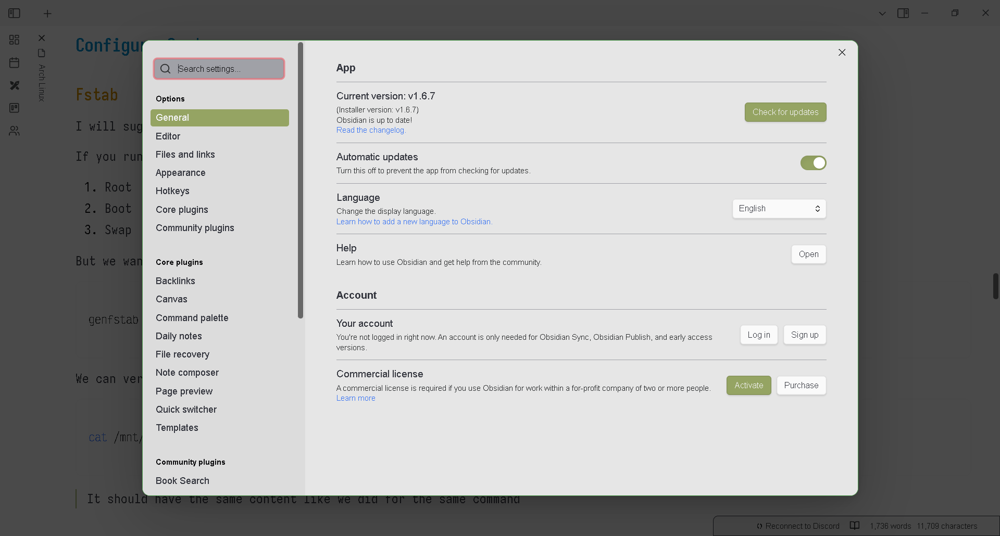

# OneNice

## Background Story

For as long as I can remember, I have been using the [One Dark Pro](https://github.com/Binaryify/OneDark-Pro) theme by [binaryify](https://github.com/binaryify) and I **love** it!
Its clean, minimal aesthetics really appeal to me.

Then I started using [Obsidian](https://www.obsidian.md) and was sad to see that our beloved One Dark Pro theme was not available.
Hence, I settle on [Kognise](https://kognise.dev/)'s [Atom](https://github.com/kognise/obsidian-atom) theme for Obsidian.

>Great theme! Really recommend using it; been using basically *forever*.

The **main** reason that I want to make this theme is because coding my editor with all the colours of *One Dark Pro* and going to *obsidian-atom* feels... "*disconnected*".
Hence, I mainly wanted to reproduce my editor's feel into Obsidian.

---

## Screenshots

### Dark Mode

Links and Headings

Code Block and Lists

---

Links and Headings

Code Block and Lists

Graph View

Settings View

---

## Notable Plugins

- [Iconize](https://github.com/FlorianWoelki/obsidian-iconize)
- [Dataview](https://github.com/blacksmithgu/obsidian-dataview)
- [Templater](https://github.com/SilentVoid13/Templater)
- [Calendar](https://github.com/liamcain/obsidian-calendar-plugin)
- [Highlightr](https://github.com/chetachiezikeuzor/Highlightr-Plugin)

---

>[!note]
>Some of the fonts that I usually use:
>
>- JetBrainsMono ( *all time favourite* )
>- Iosevka ( *currently using / active* )
>- VictorMono Nerd Font ( *for code block* )

>[!warning]
>I use a 1366 $\times$ 782 monitor, but I have set my resolution to 1920 $\times$ 1080.
>Hence, this is the reason why the text ( *might be* ) is blurry!

---

## Inspiration and References

- [obsidian-atom](https://github.com/kognise/obsidian-atom)
- [onedark.nvim](https://github.com/navarasu/onedark.nvim)
- [onedarkpro.nvim](https://github.com/olimorris/onedarkpro.nvim)
- [OneDark-Pro](https://github.com/Binaryify/OneDark-Pro)

>[!note]
>Special thanks to [R.Paquiom](https://www.instagram.com/yvng._roy/) for helping me with some of the colours and deciding  on

>I don't really like "*Web Development*" but I wanted to try something and I think it turned out okay
>If you have any suggestion on the colours, _specially for the light **theme**_.
>Feel free to message me over at [s.sunhaloo](https://www.instagram.com/s.sunhaloo)
>
>Hope you enjoy using this theme!

---

S.Sunhaloo - R.Paquiom
Thank You!
